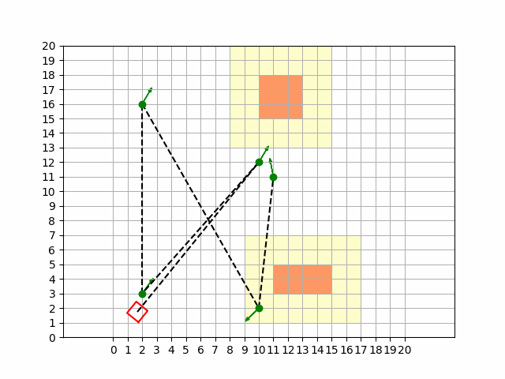

# Robot Simulation with MPC and Obstacles

This project implements a robot simulation using the Model Predictive Control (MPC) approach to navigate the robot from a starting point to a target point while avoiding obstacles. The robot is controlled by a cost function that considers both the distance to target waypoints and the proximity to obstacles. The project uses the `matplotlib` library for visualization and `scipy` for optimizing the MPC.


## Project Structure

- **`Robot`**: A class representing the robot, which controls its movement based on velocities and rotations.
- **`Obstacle`**: A class representing an obstacle, with a method to calculate the cost (penalty) based on the robot's proximity to the obstacle.
- **`MPCController`**: A class that implements the Model Predictive Control (MPC) algorithm to compute optimal control commands for the robot.
- **`RobotSimulation`**: A class that handles the simulation and integrates the visualization in a Tkinter window.

## Cost Function

The **cost function** of the MPC controller consists of several components that control the robot's movement:

1. **Position Error**: This penalty measures the difference between the robot's current position and the target point (waypoint). A larger deviation from the target results in a higher penalty.
   
   \[
   \text{Error} = x_{\text{next}} - \text{target}
   \]
   
   where \( x_{\text{next}} \) is the robot's position at the next time step and \( \text{target} \) is the waypoint. This difference is amplified by a weighting matrix \( Q \), which determines the penalty for deviations in the different dimensions (x, y, orientation):

   \[
   \text{Cost} = \text{Error}^T \cdot Q \cdot \text{Error}
   \]

2. **Obstacle Avoidance**: This penalty calculates the distance of the robot to obstacles. If the robot gets too close to an obstacle, an exponential penalty is added. The minimum distance to an obstacle is defined by a safety distance (e.g., 2.0).

3. **Control Effort**: This penalty accounts for the control inputs (velocity \( v \) and angular velocity \( \omega \)) of the robot. A higher velocity or angular speed results in a higher penalty to avoid excessive motion. This penalty is represented by a weighting matrix \( R \):

   \[
   \text{Cost} += u_{\text{curr}}^T \cdot R \cdot u_{\text{curr}}
   \]

### Summary of the Cost Function:

The total penalty for the MPC algorithm is the sum of:
- Position error
- Obstacle avoidance
- Control effort

## Features

- **Model Predictive Control (MPC)**: The robot is controlled by an MPC controller that calculates the optimal control for a prediction horizon of 10 time steps.
- **Obstacle Avoidance**: Obstacles are represented as rectangular objects, and the robot avoids them by applying an exponential penalty when getting too close to an obstacle.
- **Waypoint Navigation**: The robot follows a series of waypoints and attempts to reach them as quickly as possible while avoiding obstacles.

## Usage

1. **Install the required libraries:**

   ```bash
   pip install matplotlib numpy scipy
    ```
